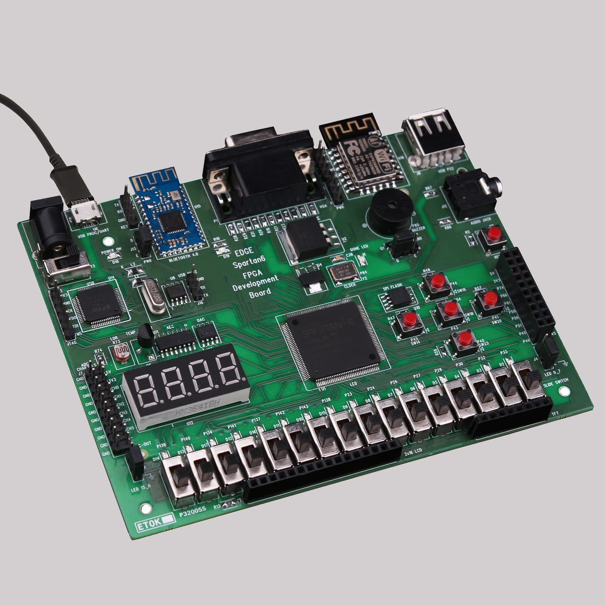

# Advanced-Encryption-Sandard-FPGA
Security plays a very important role when we are transferring data on a network. With the advancement in technology and communication, comes the need for increased security for the devices to guard information sent over the channel. Cryptography is used to achieve a secure line of communication by converting human-understandable information into an impenetrable form. There are three kinds of cryptographic techniques, namely, Symmetric key cryptography, hash functions, and Public-key cryptography. Advanced Encryption Standard (AES) is one of the Symmetric key cryptographic algorithms. The standard AES encryption and decryption is a fast, easy, and low power implementation.  It is widely used in both wired and wireless digital networks, especially public ones. In this paper, we deploy a 128-bit key AES algorithm using the Verilog-HDL, and the hardware implementation is done on the Xilinx Virtex-7 FPGA. The AES encrypts and decrypts using the same key. Considering this feature, a model is proposed that optimizes the speed, hardware usage, and power. This approach reuses the hardware blocks in the implementation. This work tries to improve the latency, throughput, speed, area, and power of AES using FPGA.

# AES Encryption 

The AES Encryption standard consists of a series of linked operations and includes multiple rounds to produce a ciphertext. In this a 4 x 4 matrix holds the data which each byte holding a single byte of information, depending on the key size both encryption and decryption contains N rounds, for a 128 bit key round there will be 10 rounds, decryption follows the same set of rounds but in a different order. 
As the number of rounds depends on the key size being used, A 128-bit key has 10 rounds, 192 bit contains 12 rounds, and 256 bit contains 14 rounds. Each of these rounds requires a round key. As only one key is given as input thus key expansion takes place which produces the round key for each round, even for the zeroth round

In the AES encryption algorithm, each round consists of four rounds that run orderly, which include:

1.Substitution of the bytes 

2.Shifting the rows 

3.Mixing the columns 

4.Adding the round key

Detailed explanation of each round and final results can be seen here : https://docs.google.com/document/d/1jv-OUjy-XpJR_GM5Ao-_7euhZXulS4otAQvEwGQ9xQo/edit?usp=sharing
